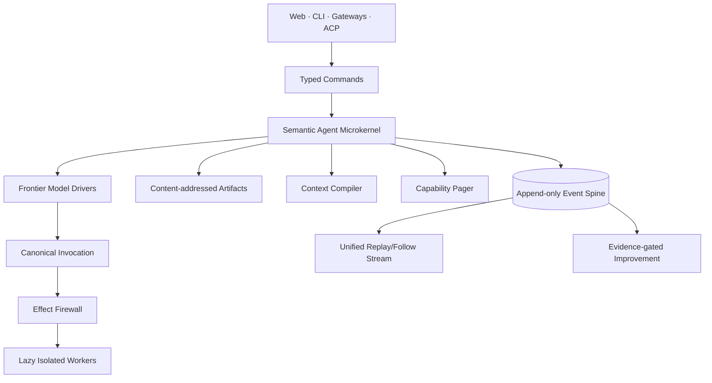

# Ditto

**A local-first semantic microkernel for frontier agents.**

One daemon, infinite capabilities, constant context.

> Context is compiled. Capabilities are paged. Effects are leased. Improvements
> are promoted.

Ditto lets frontier models retain strategic freedom while the runtime controls
context, capabilities, side effects, persistence, verification, and long-lived
execution. It is not a planner/executor framework, persona zoo, or always-on
reflection loop.

## Current state

The executable foundation includes:

- a schema-versioned, DB-enforced append-only SQLite event spine;
- typed public command ingress with kernel-owned actor and event kind;
- subscribe-first, high-water-bounded, paginated SSE replay and lag recovery;
- SHA-256 content-addressed artifacts with private storage and verified reads;
- file-backed capability manifests, validated complements, strict runtime search,
  and bounded execution epochs;
- typed Context IR with provenance validation, trusted compiler directives, and
  locally derived token cost;
- orthogonal effect profiles and fail-closed lease primitives;
- repository-native instructions for long-running coding agents.

Production model drivers, capability execution, SSH, embeddings, authenticated
remote gateways, completion verifiers, and the improvement compiler are still
deferred. They are not represented by fake success paths.

## Quick start

Requires Rust 1.88 or newer.

```bash
# Terminal 1
cargo run -p ditto-daemon -- \
  --data-dir .ditto \
  --capabilities-dir capabilities \
  --bind 127.0.0.1:8787

# Terminal 2
cargo run -p ditto-cli -- ping
cargo run -p ditto-cli -- input "hello from ditto" --session local
cargo run -p ditto-cli -- events --session local
cargo run -p ditto-cli -- capabilities "run a command on another computer"

curl -N 'http://127.0.0.1:8787/v1/stream?after_seq=0'
```

The daemon refuses non-loopback binding without the explicitly unsafe
`--allow-unauthenticated-remote` escape hatch. That flag does not add
authentication; use loopback until an authenticated gateway exists.

## HTTP surface

| Method | Path | Purpose |
| --- | --- | --- |
| `GET` | `/health` | Liveness, durable count, and latest sequence |
| `POST` | `/v1/commands/input` | Submit user input; kernel assigns event authority |
| `GET` | `/v1/events` | Query one durable event page |
| `GET` | `/v1/stream` | Replay all pages through a high-water mark, then follow |
| `GET` | `/v1/capabilities` | Catalogue-level capability card search |

There is intentionally no public arbitrary event-append endpoint.

## Architecture



- **The model owns intent, strategy, and judgment.**
- **The harness owns context, capabilities, effects, persistence, and execution
  lifetime.**

See [`docs/architecture.md`](docs/architecture.md).

## Development

```bash
./scripts/agent-check.sh
```

Long-running Codex or other coding-agent work starts at [`AGENTS.md`](AGENTS.md)
and [`docs/agent/NEXT.md`](docs/agent/NEXT.md). A paste-ready autonomous-run
prompt lives in [`docs/agent/CODEX-RUN.md`](docs/agent/CODEX-RUN.md).

The next active slice is the provider-neutral model IR, specified in
[`docs/agent/tasks/001-model-ir.md`](docs/agent/tasks/001-model-ir.md).

## Invariants

1. No housekeeping-only model call.
2. No eager capability implementation loading.
3. No full capability catalogue in model context.
4. No durable memory without provenance and scope.
5. No model inference represented as a user assertion.
6. No public client choosing trusted event authority.
7. No side effect authorized from a model's self-reported effect.
8. No credential material visible to the model.
9. No privileged action without a bounded lease.
10. No verified completion without task-specific evidence.
11. No permanent improvement from one successful trajectory.
12. No periodic LLM heartbeat when an event can wake the task.
13. No mandatory infrastructure beyond one daemon and local storage.

## License

Licensed under either Apache License 2.0 or MIT, at your option.
