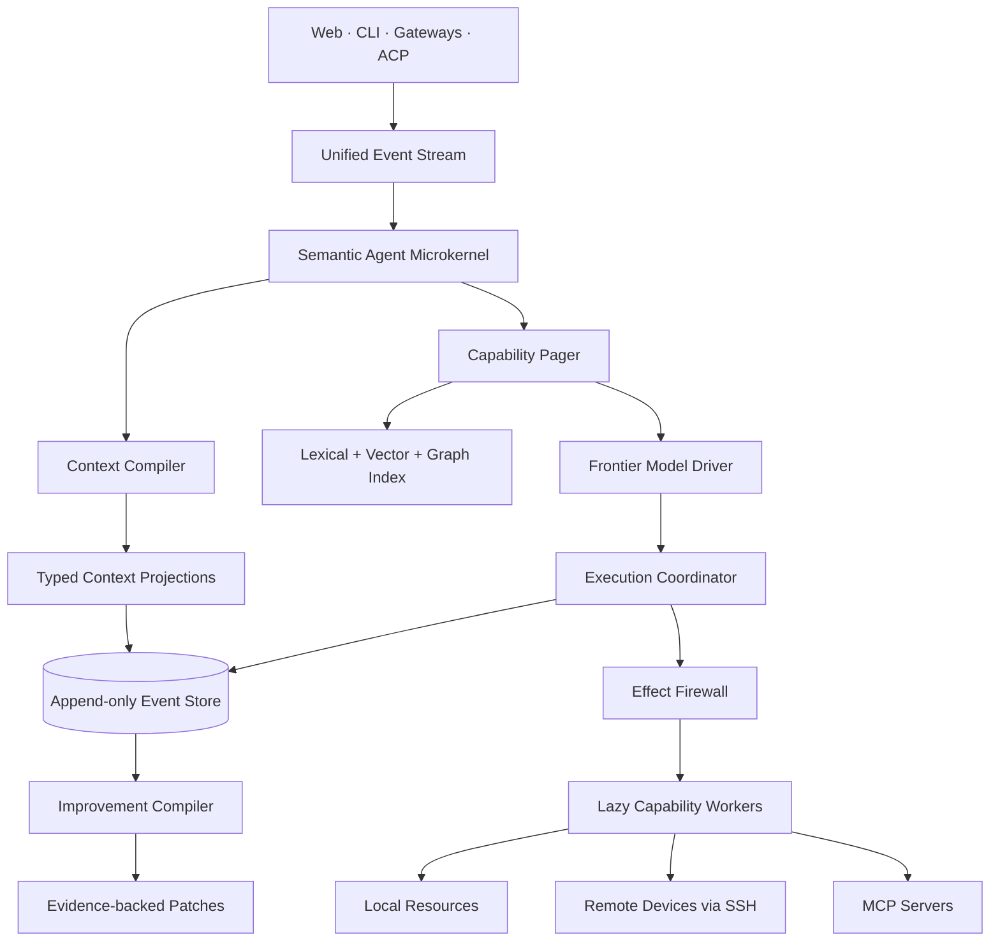

# Ditto

**A local-first semantic microkernel for frontier agents.**

One daemon, infinite capabilities, constant context.

> Context is compiled. Capabilities are paged. Effects are leased. Improvements are promoted.

Ditto is an agent harness for people who want frontier models to retain their freedom while the runtime handles context, capabilities, side effects, persistence, and long-lived execution. It is deliberately not a planner/executor framework, a persona zoo, or an always-on reflection loop.

## Status

This repository currently contains the first executable vertical slice:

- an append-only SQLite event spine with WAL enabled;
- a Rust daemon exposing HTTP and Server-Sent Events;
- a CLI that records inputs and inspects events;
- lazy capability manifests with a deterministic lexical retrieval seed;
- typed Context IR and a token-budgeted context compiler scaffold;
- bounded capability-lease primitives with deny-by-default checks;
- architecture, protocol, and self-improvement specifications.

Model providers, SSH transport, artifact storage, hybrid embedding retrieval, and the improvement compiler are intentionally not faked in this commit. They are the next vertical slices.

## Quick start

```bash
# Terminal 1
cargo run -p ditto-daemon -- \
  --data-dir .ditto \
  --capabilities-dir capabilities \
  --bind 127.0.0.1:8787

# Terminal 2
cargo run -p ditto-cli -- ping
cargo run -p ditto-cli -- input "hello from ditto" --session local
cargo run -p ditto-cli -- events --session local
cargo run -p ditto-cli -- capabilities "run a command on another computer"

# The event stream is resumable through the Last-Event-ID equivalent: after_seq.
curl -N 'http://127.0.0.1:8787/v1/stream?after_seq=0'
```

The default data directory contains a single `state.db`. No Redis, Postgres, graph database, vector database, Docker daemon, or cloud account is required.

## Architecture



The ownership boundary is strict:

- **The model owns intent, strategy, and judgment.**
- **The harness owns context, capabilities, effects, persistence, and execution lifetime.**

See [Architecture](docs/architecture.md) for the full design.

## HTTP surface

| Method | Path | Purpose |
|---|---|---|
| `GET` | `/health` | Liveness and durable event count |
| `POST` | `/v1/events` | Append a typed event |
| `GET` | `/v1/events` | Query durable events |
| `GET` | `/v1/stream` | Replay then follow the event stream over SSE |
| `GET` | `/v1/capabilities` | List or search capability cards |

The event log is the source of truth. UI state, task state, memory projections, audits, replay tests, and later self-improvement signals are derived from it.

## Repository layout

```text
apps/
  daemon/           HTTP/SSE daemon
  cli/              Local operator CLI
crates/
  protocol/         Stable wire and event types
  event-store/      SQLite event spine
  capability/       Manifests, cards, retrieval seed
  context/          Typed Context IR and compiler
  policy/           Effect claims and bounded leases
  kernel/           Composition root and event fan-out
capabilities/core/  Built-in capability manifests
docs/               Architecture, ADRs, and specifications
```

## Invariants

1. No model call solely for housekeeping.
2. No capability implementation loaded before use.
3. No full tool catalogue in model context.
4. No durable memory without provenance and scope.
5. No agent inference represented as a user-confirmed fact.
6. No external side effect without a typed effect claim.
7. No credential material visible to the model.
8. No privileged action without a bounded lease.
9. No completion without evidence or an explicit unverified state.
10. No permanent improvement from one successful trajectory.
11. No self-edit outside a typed, versioned patch surface.
12. No client-specific agent loop.
13. No periodic LLM heartbeat when an event can wake the task.
14. No subagent unless isolation or parallelism has measurable value.
15. No mandatory infrastructure beyond one daemon and local storage.

## Performance gates

These are CI/benchmark targets, not marketing claims:

| Metric | Initial gate |
|---|---:|
| Core daemon cold start, Linux x64 | `< 200 ms` |
| Core idle RSS | `< 50 MiB` |
| Event append p95 | `< 5 ms` |
| Warm context + capability retrieval p95 | `< 30 ms` |
| Stable harness prompt | `< 700 tokens` |
| Housekeeping model calls on a simple turn | `0` |
| Preloaded tool schemas p95 | `<= 6` |
| Privileged actions without a lease | `0` |
| Improvement patches without evidence | `0` |

Model network time, optional embedding workers, browsers, and capability workers are measured separately from core overhead.

## Development

```bash
cargo fmt --all --check
cargo clippy --workspace --all-targets --all-features -- -D warnings
cargo test --workspace --all-features
```

The next implementation sequence is tracked in [the roadmap](docs/roadmap.md).

## License

Licensed under either of Apache License, Version 2.0 or MIT license at your option.
