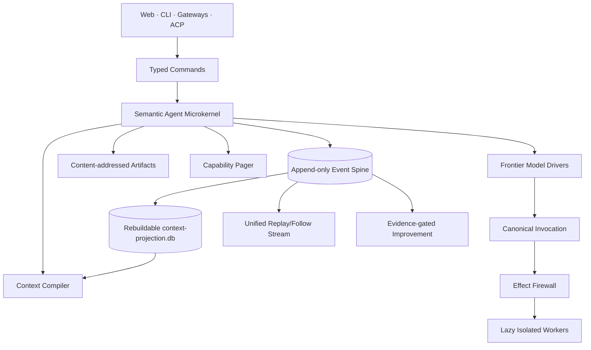

# Ditto

**A local-first personal general-purpose agent.**

Ditto is being built to keep personal AI work effective, responsive, and
resource-efficient as memories, capabilities, schedules, and experience grow.
Its product goals are lower memory overhead, focused context, reliable memory
and scheduled work, and improvements that earn their ongoing cost. These are
goals to measure, not performance claims already established by the foundation.
**Zero cost, zero overhead** is a primary design premise, including development
effort and future technical debt converging toward zero.

> Context is compiled. Capabilities are paged. Effects are leased. Improvements
> are promoted.

Its semantic microkernel lets frontier models retain strategic freedom while
the runtime controls context, capabilities, side effects, persistence,
verification, and long-lived execution. The personal agent is the product;
the microkernel is its implementation architecture.

See the [product intent](docs/product.md) for the intended user experience,
long-term efficiency goals, and proposed evaluation criteria.

## Current state

The executable foundation includes:

- a schema-versioned, DB-enforced append-only SQLite event spine;
- typed public command ingress with kernel-owned actor and event kind;
- subscribe-first, high-water-bounded, paginated SSE replay and lag recovery;
- SHA-256 content-addressed artifacts with private storage and verified reads;
- compact capability package headers, bounded no-follow discovery on Linux/macOS,
  selected full-manifest verification, strict runtime search, and bounded
  execution epochs; headerless packages retain a bounded compatibility path;
- typed Context IR with provenance validation, trusted compiler directives, and
  locally derived token cost;
- kernel-only trusted admission of session/task context nodes as fixed
  `context.node.recorded` events in the canonical event spine, plus a separate,
  checkpointed and rebuildable `context-projection.db` cache;
- explicit session memory through CLI/HTTP: save exact user text, inspect current
  memories, and correct an active memory with idempotent input promotion;
- one bounded V2 `TaskQuery` shared by read-only joint context/capability
  working-set retrieval, with production lexical ranking and an explicit
  injected embedding seam for tests and explicit local composition;
- orthogonal effect profiles and fail-closed lease primitives;
- versioned provider-neutral model IR, a closed OpenAI Responses adapter, and an
  injected-driver read-only artifact continuation loop;
- explicit CLI/HTTP model runs with current session context, durable retry
  identity, cancellation, and restart inspection;
- repository-native instructions for long-running coding agents.

Scheduled execution, additional model
providers, effectful capability execution, SSH, a production embedding
worker/cache, authenticated remote gateways, completion verifiers, and the
improvement compiler are still deferred. They are not represented by fake
success paths.

## Quick start

Requires Rust 1.88 or newer.

```bash
# Terminal 1
cargo run -p ditto-daemon -- \
  --data-dir .ditto \
  --capabilities-dir capabilities \
  --bind 127.0.0.1:8787

# Terminal 2
cargo run -p ditto-cli -- ping
cargo run -p ditto-cli -- input "hello from ditto" --session local
cargo run -p ditto-cli -- events --session local
cargo run -p ditto-cli -- capabilities "run a command on another computer"

# Explicit memories default to the persistent personal session.
cargo run -p ditto-cli -- memory save "I prefer afternoon meetings"
cargo run -p ditto-cli -- memory list
# Use an ID returned above to correct that memory:
# cargo run -p ditto-cli -- memory save "I prefer morning meetings" --replaces MEMORY_ID

curl -N 'http://127.0.0.1:8787/v1/stream?after_seq=0'
```

The daemon refuses non-loopback binding without the explicitly unsafe
`--allow-unauthenticated-remote` escape hatch. That flag does not add
authentication; use loopback until an authenticated gateway exists.

To answer requests, explicitly start the daemon with `--provider openai` and
provide `OPENAI_API_KEY` through its environment. This selects the existing
closed `gpt-5.6` adapter and may incur provider charges. The default is
`--provider disabled`; startup, input recording, memory operations, and recovery
make no model calls. Enabled model execution requires loopback even with the
remote escape hatch.

```bash
cargo run -p ditto-cli -- run "What is my meeting preference?"
# run prints the request ID before submission, then waits on durable events.
# Use --detach to return after acceptance, or --request-id ID for an exact retry.
cargo run -p ditto-cli -- run-status REQUEST_ID
cargo run -p ditto-cli -- run-cancel REQUEST_ID
```

Runs default to the `personal` session. Relevant current session memory is
compiled into context; prior conversation text is not automatically reinserted.
The model can answer directly or read an already-rooted, same-scope artifact.
General file/process tools are not connected yet. One run executes at a time;
other work is rejected without queuing. An interrupted run is inspectable and
never automatically restarted. A model answer remains `unverified`.

## HTTP surface

| Method | Path | Purpose |
| --- | --- | --- |
| `GET` | `/health` | Liveness, durable count, and latest sequence |
| `POST` | `/v1/commands/input` | Submit user input; kernel assigns event authority |
| `POST` | `/v1/commands/memory` | Save an existing same-session user input, optionally replacing an active memory |
| `GET` | `/v1/memories` | Inspect current session memories with an ID cursor |
| `POST` | `/v1/commands/run` | Explicitly admit one model run using a stable request ID |
| `GET` | `/v1/runs` | Inspect a run by session and request ID |
| `POST` | `/v1/commands/run/cancel` | Signal cancellation of the matching live run |
| `GET` | `/v1/events` | Query one durable event page |
| `GET` | `/v1/stream` | Replay all pages through a high-water mark, then follow |
| `GET` | `/v1/capabilities` | Catalogue-level capability card search |

There is intentionally no public arbitrary event-append endpoint.

Memory saving uses the existing input event and context admission. Text is
bounded to 4 KiB, preserved exactly as recorded, and never inferred by a model.
Use `--session NAME` for an isolated set and `memory list --after-id ID` to
continue a page. If input capture succeeds but memory saving fails, the CLI
reports the input ID for `memory from-input INPUT_ID` recovery. A pending
projection is reported separately from the accepted durable write. See the
[memory contract](docs/specs/event-protocol.md#explicit-user-memory).

## Architecture



- **The model owns intent, strategy, and judgment.**
- **The harness owns context, capabilities, effects, persistence, and execution
  lifetime.**

See [`docs/architecture.md`](docs/architecture.md).

## Development

```bash
./scripts/agent-check.sh

# End-to-end memory verification with disposable local data:
cargo build -p ditto-daemon -p ditto-cli --locked
python3 scripts/smoke-user-memory.py
python3 scripts/smoke-agent-run.py
# Actual CLI + daemon router + deterministic model fixture, without API calls:
cargo test -p ditto-daemon built_cli_run_wait_retry_status_and_cancel -- --ignored
```

Long-running Codex or other coding-agent work starts at [`AGENTS.md`](AGENTS.md)
and [`docs/agent/NEXT.md`](docs/agent/NEXT.md). A paste-ready autonomous-run
prompt lives in [`docs/agent/CODEX-RUN.md`](docs/agent/CODEX-RUN.md).

The implementation frontier and next priority are tracked in
[`docs/agent/NEXT.md`](docs/agent/NEXT.md).

## Invariants

1. No housekeeping-only model call.
2. No eager capability implementation loading.
3. No full capability catalogue in model context.
4. No durable memory without provenance and scope.
5. No model inference represented as a user assertion.
6. No public client choosing trusted event authority.
7. No side effect authorized from a model's self-reported effect.
8. No credential material visible to the model.
9. No privileged action without a bounded lease.
10. No verified completion without task-specific evidence.
11. No permanent improvement from one successful trajectory.
12. No periodic LLM heartbeat when an event can wake the task.
13. No mandatory infrastructure beyond one daemon and local storage.

## License

Licensed under either Apache License 2.0 or MIT, at your option.
