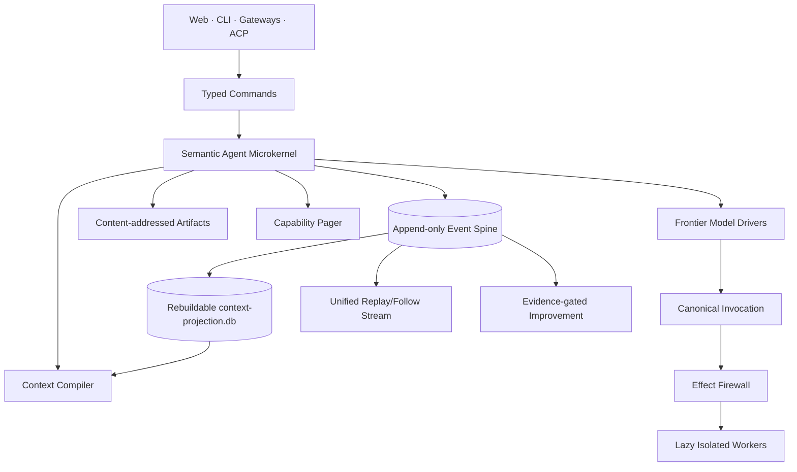

# Ditto

**A local-first personal general-purpose agent.**

Ditto is being built to keep personal AI work effective, responsive, and
resource-efficient as memories, capabilities, schedules, and experience grow.
Its product goals are lower memory overhead, focused context, reliable memory
and scheduled work, and improvements that earn their ongoing cost. These are
goals to measure, not performance claims already established by the foundation.
**Zero cost, zero overhead** is a primary design premise, including development
effort and future technical debt converging toward zero.

> Context is compiled. Capabilities are paged. Effects are leased. Improvements
> are promoted.

Its semantic microkernel lets frontier models retain strategic freedom while
the runtime controls context, capabilities, side effects, persistence,
verification, and long-lived execution. The personal agent is the product;
the microkernel is its implementation architecture.

See the [product intent](docs/product.md) for the intended user experience,
long-term efficiency goals, and proposed evaluation criteria.

## Current state

The executable foundation includes:

- a schema-versioned, DB-enforced append-only SQLite event spine;
- typed public command ingress with kernel-owned actor and event kind;
- subscribe-first, high-water-bounded, paginated SSE replay and lag recovery;
- SHA-256 content-addressed artifacts with private storage and verified reads;
- compact capability package headers, bounded no-follow discovery on Linux/macOS,
  selected full-manifest verification, strict runtime search, and bounded
  execution epochs; headerless packages retain a bounded compatibility path;
- typed Context IR with provenance validation, trusted compiler directives, and
  locally derived token cost;
- kernel-only trusted admission of session/task context nodes as fixed
  `context.node.recorded` events in the canonical event spine, plus a separate,
  checkpointed and rebuildable `context-projection.db` cache;
- explicit session memory through CLI/HTTP: save exact user text, inspect current
  memories, correct an active memory with idempotent input promotion, and
  forget any memory from the web app, CLI or Telegram;
- memory Ditto keeps current on its own: during a run it remembers lasting
  facts, replaces outdated memories and forgets on request, labeled as its
  inference, never from web pages or files, and shown under the answer;
- one bounded V2 `TaskQuery` shared by read-only joint context/capability
  working-set retrieval, with production lexical ranking and an explicit
  injected embedding seam for tests and explicit local composition;
- orthogonal effect profiles and fail-closed lease primitives;
- versioned provider-neutral model IR, a closed OpenAI Responses adapter, an
  OpenAI-compatible chat adapter for local and hosted models, and an
  injected-driver read-only artifact continuation loop;
- explicit CLI/HTTP model runs with current session context (the complete
  memory set when it fits the context budget), durable retry identity,
  cancellation, and restart inspection;
- conversation threads: runs replay the session's recent exchanges until a new
  thread is started, plus an interactive `ditto chat`;
- a chat that never makes you wait: up to four answers run at once, also in
  one conversation, each knowing what the others are still working on; a line
  Ditto writes before a tool call arrives as its own message, and a plain
  "ㅇㅋ" or "thanks" gets a 👍 reaction instead of a model call;
- a local web app served by the daemon: streamed chat, thread history,
  memories, schedules and a per-answer view of which memories were sent and
  why, behind a strict content security policy and a loopback host guard;
- a Telegram gateway (`ditto telegram`) for allowed private chats: streamed
  answers with a stop button, memory commands, and delivery of scheduled
  results, with the bot token kept out of the daemon;
- reading links: when a message contains http(s) URLs, the model may fetch
  those pages (and only those) as bounded text, with public addresses only and
  every fetch journaled;
- web search on its own through a configured SearXNG-compatible service, at
  most three queries per answer, results journaled and replayable;
- explicitly requested local artifact sorting through a one-shot process lease,
  bounded pipes/lifetime, cancellation, and independent line-contract verification;
- model-directed sorting of one explicitly attached file, with separate permission
  for deduplication and verified output inspection after model failure or restart;
- one-shot read-only schedules with durable claims, bounded timer/event wakeup,
  visible expiry/cancellation and restart inspection without automatic retry;
- finite fixed-interval repeats with independent occurrence identities, aggregate
  missed ranges and durable parent cancellation through the same scheduler;
- opt-in human CLI task views and reproducible offline RAM, latency, accounting
  and restart baselines, with production and fixture results labelled separately;
- offline synthetic memory-correction/exclusion measurements from actual
  model-facing capsules after restart, comparing minimal and longer histories;
- repository-native instructions for long-running coding agents.

Calendar cron, indefinite repeats, scheduled effect grants, general effectful
model-tool continuation, SSH, a production embedding
worker/cache, authenticated remote gateways, additional completion verifiers, and the
improvement compiler are still deferred. They are not represented by fake
success paths.

## Quick start

Requires Rust 1.88 or newer.

```bash
# Terminal 1
cargo run -p ditto-daemon -- \
  --data-dir .ditto \
  --capabilities-dir capabilities \
  --bind 127.0.0.1:8787

# Terminal 2
cargo run -p ditto-cli -- ping
cargo run -p ditto-cli -- input "hello from ditto" --session local
cargo run -p ditto-cli -- events --session local
cargo run -p ditto-cli -- capabilities "run a command on another computer"

# Explicit memories default to the persistent personal session.
cargo run -p ditto-cli -- memory save "I prefer afternoon meetings"
cargo run -p ditto-cli -- memory list
# Use an ID returned above to correct or forget that memory:
# cargo run -p ditto-cli -- memory save "I prefer morning meetings" --replaces MEMORY_ID
# cargo run -p ditto-cli -- memory forget MEMORY_ID

curl -N 'http://127.0.0.1:8787/v1/stream?after_seq=0'
```

The daemon refuses non-loopback binding without the explicitly unsafe
`--allow-unauthenticated-remote` escape hatch. That flag does not add
authentication; use loopback until an authenticated gateway exists.

To answer requests, start the daemon with an explicit provider. The default is
`--provider disabled`; input recording, memory operations, and schedule maintenance
make no model calls. With an enabled provider, startup can dispatch previously
accepted due schedules inside their start windows. Model execution requires loopback even with the
remote escape hatch.

`--provider openai-compatible` works with any server exposing the
OpenAI-compatible `/chat/completions` API, including free local models. Give the
API root and model name. Plain HTTP is accepted only for loopback hosts. A
hosted provider's key is read only from `DITTO_MODEL_API_KEY`, and hosted calls
may incur provider charges. Tools need a model with function calling;
`--include-usage` asks for token usage if the server supports it.

```bash
# Local model through Ollama (no key, no cost)
cargo run -p ditto-daemon -- --provider openai-compatible \
  --base-url http://127.0.0.1:11434/v1 --model qwen2.5:7b

# Hosted, for example xAI or OpenRouter
DITTO_MODEL_API_KEY=... cargo run -p ditto-daemon -- --provider openai-compatible \
  --base-url https://api.x.ai/v1 --model grok-4
```

`--provider openai` with `OPENAI_API_KEY` in the daemon environment selects the
closed `gpt-5.6` Responses adapter and may incur provider charges.

Open `http://127.0.0.1:8787/` for the web app. It chats in the `personal`
session (`?session=NAME` picks another), streams answers, keeps the thread
across reloads, and shows runs started from the CLI or schedules as they
happen. You can keep writing while Ditto works: each answer appears under its
own message with its own stop link. **Why?** under an answer lists the memories sent to the model and why,
memories left out, earlier exchanges included and tools used. The page uses
the same HTTP API as the CLI. While bound to loopback, the daemon answers only
requests addressed to `localhost` or a loopback IP, which stops DNS-rebinding
pages.

To use Ditto from Telegram, create a bot with @BotFather and find your
numeric user ID (for example with @userinfobot). Then run the gateway next to
the daemon:

```bash
DITTO_TELEGRAM_BOT_TOKEN=... cargo run -p ditto-cli -- telegram --allow-user 123456789
```

It long-polls Telegram, so no port or webhook is exposed. Only private chats
from allowed users are answered; others are ignored. Answers stream into a
draft with a stop button, and the next message is handled while one is in
progress; each answer replies to its own message. `/new`, `/remember <fact>`,
`/memories`, `/forget <words>` (forgets the one memory that holds the words)
and `/stop` (stops the answers in progress) work as in the CLI, and chats share the `personal` session with the CLI and
web app. Results of scheduled requests are sent to the allowed users, also
after a gateway restart (`--state-file`, default `.ditto-telegram.json`). The
token stays in the gateway process.

```bash
cargo run -p ditto-cli -- run "What is my meeting preference?"
# run prints the request ID before submission, then waits on durable events.
# Use --detach to return after acceptance, or --request-id ID for an exact retry.
cargo run -p ditto-cli -- run-status REQUEST_ID
cargo run -p ditto-cli -- run-cancel REQUEST_ID
```

Add `--human` to run, sort, schedule or repeat start/status/cancel commands and
schedule/repeat lists for readable output. JSON remains the default, including
when redirected; exit codes retain their existing meaning.

```bash
cargo run -p ditto-cli -- run "Sort this list" --sort-file list.txt --human
cargo run -p ditto-cli -- run-status REQUEST_ID --human
cargo run -p ditto-cli -- repeat-status REQUEST_ID --human
```

The human view shows model answers as **unverified**, independently of verified
sort results. It includes exact attached-artifact permission and the separate
deduplication choice, wait reasons, schedule windows and child inspection
commands. Cancellation requested is distinct from terminal cancellation;
an exhausted repeat timetable is not successful work. Inspect the child outcome.
Recoverable request/session identity and an inspection command print to stderr
before submission. If submission is uncertain, inspect first and reuse the same
ID only for the identical request. Terminal controls in human fields are escaped,
including newlines displayed as `\n`, so content cannot impersonate status lines.

The model is told it is the user's personal assistant, what the memory block
means, when to keep memories current itself, what it cannot do, and the
current local time; set `TZ` for the daemon if the machine's zone is not yours.

Ditto manages memory on its own. When you mention a lasting fact ("my dog is
called Miso", "I moved to Busan"), it remembers it, replacing a memory that
became outdated, and it forgets one when you ask. These memories are marked
as Ditto's inference: the web app says under the answer what was remembered
and badges them in the memory list, `/memories` marks them, and you correct
or forget them like your own. Ditto never remembers secrets, and never from a
page or file it read in the same answer, since those may carry instructions;
tell it again in your next message instead. At most three memory writes
happen per answer.

Links in a message can be read: "Summarize https://example.com/article" lets
the model fetch that page, and only pages linked in the message. Fetches
reach public addresses only (never this machine or the local network), follow
at most five redirects and return at most 24,000 characters of text; pages
that need JavaScript or a login yield little. Start the daemon with
`--disable-web-fetch` to turn this off.

Ditto searches the web on its own when current or outside information would
help, without asking first. Point the daemon at a SearXNG-compatible search
service you trust, for example a local one:

```bash
docker run -d -p 8888:8080 searxng/searxng   # enable the JSON format in its settings
cargo run -p ditto-daemon -- --provider openai-compatible ... --search-url http://127.0.0.1:8888
```

Queries go only to that service, at most three per answer, and never one
that looks like a password or key. Results come back as titles, links and
snippets, treated as untrusted content; Ditto does not save memories from
them in the same answer. Without `--search-url` there is no web search.

Ditto works on its own in general: it uses its tools without asking, and
when something truly needs you (a decision, information only you have, or
consent to something irreversible) it ends its answer with exactly that
question and stops; your next message continues. A short acknowledgment such
as "ㅇㅋ", "ok", "고마워" or "thanks" after an answer that asked nothing is
recorded with a 👍 and costs no model call; after a question it is an answer.

Runs default to the `personal` session. Current session memory is compiled
into context: while the whole set fits the context budget (about a dozen short
memories), the model receives all of it with lexical matches first, so a
paraphrased question such as "What is my meeting preference?" still reaches
"I prefer afternoon meetings". Larger sessions fall back to lexical matching and
can miss paraphrases until semantic retrieval exists. Superseded and
other-session memories are never sent.

Runs also continue the session's conversation thread: the model receives the
newest finished exchanges (up to eight, 24 KiB) since the thread began, so a
follow-up like "What is his name?" works. Start a new thread at any time;
memories are kept:

```bash
cargo run -p ditto-cli -- chat     # interactive; /new starts a thread, /remember saves, /exit quits
cargo run -p ditto-cli -- new      # new thread for later run/chat requests
```
The model can answer directly or read an already-rooted, same-scope artifact.
An explicit attachment also permits one bounded sort:

```bash
cargo run -p ditto-cli -- run "Sort this list and explain the result" --sort-file list.txt
# Add --allow-deduplicate to also permit removing exact duplicate lines.
```

The model receives an artifact reference and the permission, with file content
available through a bounded read when needed. It cannot sort another artifact,
deduplicate without permission, or dispatch twice. `run-status` includes a
separate `sort` result: verified text remains inspectable even if the subsequent
model answer fails. Retry identity includes the exact file and permission.
General file/process tools are not connected yet. One run executes at a time;
other immediate requests are rejected without queuing. An interrupted run is inspectable and
never automatically restarted. A model answer remains `unverified`.

Local file sorting works with the default provider-disabled daemon on Linux and
macOS (`/usr/bin/sort` required):

```bash
cargo run -p ditto-cli -- sort list.txt --unique
cargo run -p ditto-cli -- sort-status REQUEST_ID
cargo run -p ditto-cli -- sort-cancel REQUEST_ID
```

The CLI reads a regular UTF-8 file of at most 64 KiB / 4096 lines. Output is JSON
by default, with sorted text and an immutable artifact reference; the original file is
unchanged. Ordering is by bytes, LF separates lines, CR remains data, and a
nonempty last line gains LF. `--unique` removes exact duplicate lines. The
process uses a cleared environment and private scratch, runs for at most five
seconds while owned, and shares the single execution slot with model runs.
`verified` means the exact line ordering and multiplicity contract passed, not
that a broader model goal was completed. Same-ID retries do not rerun work.
This closed profile has no shell or caller-selected executable. Model dispatch
requires the explicit per-run attachment above; general process profiles remain
future work.

Submission states the exact file, byte count and deduplication choice. The
standalone sort status response does not contain its input reference or mode;
the human view says these are unavailable there. Model-run status does contain
the attached input reference and deduplication permission. Neither path creates
a durable grant or fulfills general approval requests.

One-time future requests use the same agent and current session memory. Choose
future timestamps with explicit offsets; the second timestamp is the exclusive
latest start, at most 24 hours after the due time:

```bash
cargo run -p ditto-cli -- schedule "Summarize my meeting preferences" \
  --at "2026-09-10T09:00:00+09:00" --expires "2026-09-10T10:00:00+09:00"
cargo run -p ditto-cli -- schedule-list
cargo run -p ditto-cli -- schedule-status REQUEST_ID
cargo run -p ditto-cli -- schedule-cancel REQUEST_ID
```

Scheduling prints the request ID before submission and returns after durable
acceptance. Identical `--request-id` retries retain the original attempt. Up to
100 pending one-shot requests and active repeats can wait in total without
loading a prompt pool or calling a model. The
default disabled provider retains them until expiry; status explains what they
are waiting for. An enabled provider dispatches due work when fewer than four runs
are active. A missed window becomes `missed`, and an uncertain claimed attempt after
restart becomes `interrupted`; neither retries automatically. Completed answers
remain `unverified`, with the original run result available through status.

Scheduled work supports text requests and scoped artifact reads. Scheduled sort
permissions and notification delivery remain future work.
See [the time, restart and delivery contract](docs/adr/0019-one-shot-scheduled-runs.md).

To repeat the request daily for seven occurrences, give the first start window,
an elapsed-time interval and a finite count:

```bash
cargo run -p ditto-cli -- repeat "Summarize my meeting preferences" \
  --at "2026-09-10T09:00:00+09:00" --expires "2026-09-10T10:00:00+09:00" \
  --every-seconds 86400 --occurrences 7
cargo run -p ditto-cli -- repeat-list
cargo run -p ditto-cli -- repeat-status REQUEST_ID
cargo run -p ditto-cli -- repeat-cancel REQUEST_ID
```

Intervals range from 60 seconds to 31 days; counts range from 2 to 1000 and the
last due time must fall within one year. Each start window is anchored to the
first, without shifting after a slow run. Expired occurrences become a visible
missed count; only the currently eligible occurrence can run after downtime.
`repeat-status` includes the latest child's schedule ID and original result.
`schedule-status CHILD_ID` also inspects that occurrence, and `schedule-cancel
CHILD_ID` cancels only that occurrence. `repeat-cancel` stops future occurrences
and signals the series' active child. Parent `exhausted` means all timetable
entries were consumed; inspect the child result for work outcome. These are fixed
intervals, without named-time-zone or daylight-saving calendar adjustments. See
[the repeat contract](docs/adr/0020-bounded-recurring-schedules.md).

## HTTP surface

| Method | Path | Purpose |
| --- | --- | --- |
| `GET` | `/health` | Liveness, durable count, and latest sequence |
| `POST` | `/v1/commands/input` | Submit user input; kernel assigns event authority |
| `POST` | `/v1/commands/conversation/reset` | Start a new conversation thread in a session (memories are kept) |
| `GET` | `/v1/conversation` | The current thread's newest finished exchanges, oldest first |
| `GET` | `/` | Embedded web app (`/app.js`, `/app.css`, `/favicon.svg`) |
| `POST` | `/v1/commands/memory` | Save an existing same-session user input, optionally replacing an active memory |
| `POST` | `/v1/commands/memory/forget` | Forget one active memory, yours or one Ditto inferred |
| `GET` | `/v1/memories` | Inspect current session memories with an ID cursor |
| `POST` | `/v1/commands/run` | Admit one model run, optionally permitting one attached-file sort |
| `GET` | `/v1/runs` | Inspect a run by session and request ID |
| `POST` | `/v1/commands/run/cancel` | Signal cancellation of the matching live run |
| `POST` | `/v1/commands/schedule` | Durably schedule one future read-only request; loopback only |
| `GET` | `/v1/schedules` | Inspect schedule and original run by session/request ID; loopback only |
| `GET` | `/v1/schedules/pending` | List pending schedules in one session; loopback only |
| `POST` | `/v1/commands/schedule/cancel` | Cancel pending or active scheduled work; loopback only |
| `POST` | `/v1/commands/repeat` | Accept a finite repeat with explicit interval/count; loopback only |
| `GET` | `/v1/repeats` | Inspect repeat progress and latest child result; loopback only |
| `GET` | `/v1/repeats/active` | List active repeats in one session; loopback only |
| `POST` | `/v1/commands/repeat/cancel` | Cancel future occurrences and signal the active child; loopback only |
| `POST` | `/v1/commands/sort` | Explicit local sort with exact request identity; loopback only |
| `GET` | `/v1/sorts` | Inspect verified sort output by session and request ID; loopback only |
| `POST` | `/v1/commands/sort/cancel` | Cancel the matching sort; loopback only |
| `GET` | `/v1/events` | Query one durable event page |
| `GET` | `/v1/stream` | Replay all pages through a high-water mark, then follow |
| `GET` | `/v1/capabilities` | Catalogue-level capability card search |

There is intentionally no public arbitrary event-append endpoint.

Memory saving uses the existing input event and context admission. Text you
save is bounded to 4 KiB and preserved exactly as recorded; memories Ditto
writes itself are listed with `"inferred": true`. Forgetting takes a memory out
of use and listings; the append-only journal keeps its record.
Use `--session NAME` for an isolated set and `memory list --after-id ID` to
continue a page. If input capture succeeds but memory saving fails, the CLI
reports the input ID for `memory from-input INPUT_ID` recovery. A pending
projection is reported separately from the accepted durable write. See the
[memory contract](docs/specs/event-protocol.md#explicit-user-memory).

## Architecture


```mermaid
flowchart TB
    UI[Web · CLI · Gateways · ACP] --> CMD[Typed Commands]
    CMD --> KERNEL[Semantic Agent Microkernel]
    KERNEL --> STORE[(Append-only Event Spine)]
    STORE --> PROJ[(Rebuildable context-projection.db)]
    KERNEL --> ART[Content-addressed Artifacts]
    KERNEL --> CTX[Context Compiler]
    PROJ --> CTX
    KERNEL --> PAGER[Capability Pager]
    KERNEL --> MODEL[Frontier Model Drivers]
    MODEL --> EXEC[Canonical Invocation]
    EXEC --> POLICY[Effect Firewall]
    POLICY --> WORKERS[Lazy Isolated Workers]
    STORE --> CLIENTS[Unified Replay/Follow Stream]
    STORE --> IMPROVE[Evidence-gated Improvement]
```

- **The model owns intent, strategy, and judgment.**
- **The harness owns context, capabilities, effects, persistence, and execution
  lifetime.**

See [`docs/architecture.md`](docs/architecture.md).

## Development

```bash
./scripts/agent-check.sh

# End-to-end memory verification with disposable local data:
cargo build -p ditto-daemon -p ditto-cli --locked
python3 scripts/smoke-user-memory.py
python3 scripts/smoke-agent-run.py
python3 scripts/smoke-local-sort.py
# Actual CLI + daemon router + deterministic model fixture, without API calls:
cargo test -p ditto-daemon built_cli_run_wait_retry_status_and_cancel -- --ignored
cargo test -p ditto-daemon built_cli_model_sort_permission_retry_and_disabled_status -- --ignored
# Telegram gateway against a mock Bot API and the daemon router:
cargo test -p ditto-daemon built_cli_telegram_gateway -- --ignored
# Web app in headless Chromium against the real daemon and a mock model
# (needs puppeteer-core on NODE_PATH; CHROME_PATH defaults to /usr/bin/chromium):
node scripts/web-e2e.js

# Offline personal-agent baseline (cached dependencies/toolchain required):
python3 scripts/personal-baseline.py --output /tmp/ditto-baseline.json
# Synthetic context/history comparison (1,000 unrelated memories, five queries):
python3 scripts/personal-quality.py --output target/personal-quality.json
```

The baseline builds with `--offline --locked`, uses disposable stores and a
cleared runtime environment, and calls no live provider. It records 12 repeated
requests by default, startup/recovery readiness, idle/repeated RAM, raw CLI
latencies and p50/p95, model/tool dispatch accounting, exact retry and restart
evidence. Linux `/proc` supplies server RSS/high-water RSS; unsupported readings
are null. Debug production-daemon results with the provider disabled are separate
from the injected fixture test server. Known external provider spend is zero;
missing token usage, live-equivalent model cost, model quality and isolated
model/tool/overhead timing remain unknown. This small baseline does not establish
live-agent quality, long-use efficiency, zero total cost or v0.1 readiness.
See the [Task 014 contract](docs/agent/tasks/014-status-baselines.md) and
[measured evidence](docs/agent/tasks/014-evidence.md).

The Task 015 harness compares zero versus 1,000 unrelated memories by default,
with five unique queries per profile after exact correction and process restart.
It checks the actual model-facing capsule against a frozen rule: the complete
current memory set when it fits the budget, otherwise only the lexical matches,
always without stale or other-session memories, independently of the fixed
fixture answer. `--history-size` (1–5000) and `--samples` (2–100) bound the work; the
canonical gate runs a small smoke. Raw samples, context bytes/nodes, RSS,
storage/events, call counts and exact source/Cargo artifact hashes are recorded.
This is one synthetic scenario, not general or live-answer quality,
semantic retrieval, cross-session recall or performance superiority. See the
[Task 015 contract](docs/agent/tasks/015-quality-history-workloads.md) and
[evidence](docs/agent/tasks/015-evidence.md). Raw reports stay out of the
working tree; evidence files record their summary and SHA-256.

Long-running Codex or other coding-agent work starts at [`AGENTS.md`](AGENTS.md)
and [`docs/agent/NEXT.md`](docs/agent/NEXT.md). A paste-ready autonomous-run
prompt lives in [`docs/agent/CODEX-RUN.md`](docs/agent/CODEX-RUN.md).

The implementation frontier and next priority are tracked in
[`docs/agent/NEXT.md`](docs/agent/NEXT.md).

## Invariants

1. No housekeeping-only model call.
2. No eager capability implementation loading.
3. No full capability catalogue in model context.
4. No durable memory without provenance and scope.
5. No model inference represented as a user assertion.
6. No public client choosing trusted event authority.
7. No side effect authorized from a model's self-reported effect.
8. No credential material visible to the model.
9. No privileged action without a bounded lease.
10. No verified completion without task-specific evidence.
11. No permanent improvement from one successful trajectory.
12. No periodic LLM heartbeat when an event can wake the task.
13. No mandatory infrastructure beyond one daemon and local storage.

## License

Licensed under either Apache License 2.0 or MIT, at your option.
