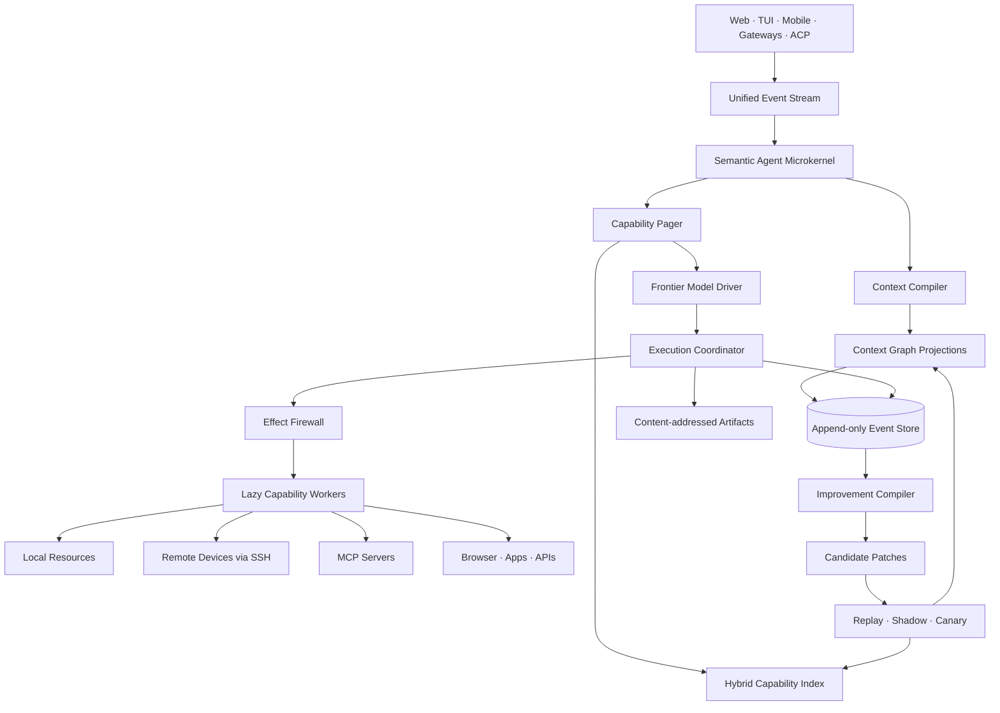

# 결론

이건 충분히 새로 만들 가치가 있다. 다만 **“Hermes를 Rust/Bun으로 다시 만든 경량판”**으로 접근하면 결국 똑같이 무거워진다.

네가 만들어야 할 건 일반적인 에이전트 프레임워크가 아니라, 다음 한 문장으로 설명되는 **Semantic Agent Microkernel**이다.

> **Context is compiled. Capabilities are paged. Effects are leased. Improvements are promoted.**
> 컨텍스트는 컴파일하고, 능력은 필요할 때 페이지 인하며, 부작용은 권한 임대로 통제하고, 개선은 검증 후 승격한다.

가장 중요한 책임 분리는 이것이다.

> **모델은 의도·전략·판단을 소유한다.
> 하네스는 컨텍스트·능력·부작용·영속성·실행 수명을 소유한다.**

즉 모델에게 “항상 계획부터 세워라”, “무조건 planner → executor → reviewer를 거쳐라” 같은 워크플로우를 강제하지 않는다. 모델의 생각을 관리하려 들지 않고, **모델이 보는 세계와 모델이 세계에 끼칠 수 있는 영향만 정교하게 관리**하는 구조다.

---

# 1. Hermes와 Prime에서 실제로 가져갈 것

네 Hermes 인스턴스가 망가진 건 단순히 Python이라서가 아니다. 더 근본적으로는 다음 세 가지가 겹쳤기 때문이다.

Hermes는 현재 동기식 Python `AIAgent`가 프롬프트 구성, 도구 실행, 재시도, 압축, 영속성을 맡고 있고, 약 28개 toolset의 70개 이상 도구가 import 시점에 registry에 self-register된다. 스킬은 progressive disclosure를 쓰지만 목록 메타데이터만으로도 공식 문서 기준 약 3k 토큰이며, 자동 background review는 기본적으로 메인 모델을 사용하고 메모리와 스킬을 자유롭게 수정할 수 있다. 네 인스턴스처럼 스킬이 700개까지 불어나면 실제 목록 비용과 검색 혼선이 더 커지는 건 자연스러운 결과다. ([Hermes Agent][1])

따라서 Hermes의 문제는 대략 이렇게 요약할 수 있다.

* **Eager composition**: 실행 전에 너무 많은 모듈과 능력이 이미 시스템 일부가 된다.
* **Unbounded learning surface**: 개선 결과가 파일·스킬이라는 영구 자산으로 너무 쉽게 승격된다.
* **Review on the hot path**: 사용자 요청과 직접 관계없는 자기반성이 계속 모델 호출과 저장을 만든다.
* **Catalogue-shaped context**: 지금 필요한 능력이 아니라 설치된 능력의 존재 자체가 컨텍스트 비용을 만든다.

Prime은 여기서 구조적으로 훨씬 낫다. 전체가 Python인 것은 아니고, provider·세션·스케줄·자식 생명주기는 TypeScript host가 소유하며 모델이 보는 프로그래밍 환경만 persistent Python kernel이다. 모델에는 기본적으로 `ipython`이라는 좁은 표면을 주고, 상태를 kernel에 유지하며, 자식 작업과 장기 세션을 host가 관리한다. 스킬도 startup에는 metadata만 올린다. 다만 그 Python kernel은 worker의 OS 권한으로 모델 생성 코드를 실행하며 보안 샌드박스가 아니고, 범용 개인 비서의 모든 실행을 persistent Python control environment로 수렴시키는 건 네 목적에는 지나치게 강한 가정이다. ([GitHub][2])

따라서 가져올 것과 버릴 것은 명확하다.

| 구분     | 가져올 것                                                                                                        | 버릴 것                                                                        |
| ------ | ------------------------------------------------------------------------------------------------------------ | --------------------------------------------------------------------------- |
| Hermes | 다양한 gateway에 동일 agent core를 연결하는 방식, 능력의 progressive disclosure                                              | import-time tool registry, per-turn background review, 무한히 커지는 SKILL.md 저장소 |
| Prime  | host/runtime 분리, persistent task state, daemon session, 좁은 model-facing surface                              | Python을 유일한 범용 실행 환경으로 삼는 것, 비샌드박스 model code execution                     |
| 새 하네스  | event-sourced daemon, capability paging, inspectable context graph, effect lease, evidence-gated improvement | 고정 planner pipeline, agent persona zoo, 항상 켜진 reviewer, 외부 DB 의존            |

---

# 2. 전체 아키텍처



핵심은 다섯 개다.

1. **Event Spine** — 모든 상태의 유일한 원본
2. **Context Compiler** — 작업마다 필요한 맥락을 컴파일
3. **Capability Pager** — 필요한 tool/skill/schema만 페이지 인
4. **Effect Firewall** — SSH, 파일 수정, 메시지 전송 같은 부작용 통제
5. **Improvement Compiler** — 경험을 검증 가능한 패치로 전환

---

# 3. Event Spine: 모든 것을 이벤트로 만들기

## SQLite는 저장소고, 이벤트 로그가 진실이다

홈서버 규모에서는 Kafka, Redis, Postgres, Neo4j, 별도 vector DB가 전부 필요 없다.

Rust daemon 하나와 SQLite WAL, 그리고 content-addressed object store면 충분하다.

```text
~/.agent/
├── state.db
├── objects/
│   └── sha256/...
├── sockets/
├── workers/
├── secrets/
└── logs/
```

`events`가 source of truth이고, 나머지 테이블은 rebuild 가능한 projection이다.

```sql
events(
  seq            INTEGER PRIMARY KEY,
  timestamp      INTEGER NOT NULL,
  session_id     TEXT,
  task_id        TEXT,
  actor          TEXT,     -- user | model | tool | policy | scheduler
  kind           TEXT,
  payload_ref    TEXT,
  causation_id   TEXT,
  correlation_id TEXT,
  span_id        TEXT
)
```

대표 이벤트는 다음 정도면 된다.

```text
input.received
context.compiled
capabilities.selected
model.started
model.delta
capability.requested
policy.approval_required
policy.lease_granted
execution.started
execution.output
artifact.created
state.patch_proposed
task.blocked
task.completed
improvement.candidate_created
improvement.promoted
```

이 구조가 중요한 이유는 UI, 메모리, 실행 상태, undo, 재현 테스트를 각각 별도로 구현하지 않아도 되기 때문이다.

* Web UI는 이벤트를 projection해서 보여준다.
* CLI가 끊겼다가 다시 붙어도 이어진다.
* gateway마다 별도 agent loop를 만들 필요가 없다.
* 실행 중 사용자가 우선순위를 바꾸거나 취소하면 새 이벤트를 넣으면 된다.
* 특정 시점에서 세션을 branch하거나 replay할 수 있다.
* 자가개선 후보가 어떤 실패에서 나왔는지 정확히 추적된다.

**프로세스 메모리 안에만 존재하는 중요한 상태는 없어야 한다.**

브라우저 탭, SSH 프로세스, 작업 디렉터리, subagent 같은 장기 리소스도 전부 `resource_handle`로 표현한다.

```text
resource:browser:7a91
resource:process:b2cc
resource:device:macbook
resource:workspace:rune-main
resource:agent-fork:review-42
```

handle의 실체가 죽더라도 하네스는 `alive`, `reconnectable`, `expired`, `orphaned` 상태를 알 수 있다.

---

# 4. Context Compiler: 대화 내용을 넣지 말고 작업 맥락을 컴파일한다

## 그래프는 저장 포맷이 아니라 중간 표현이다

“대화를 그래프화한다”를 그대로 구현해서 모든 문장을 entity-relation triplet으로 변환하고 Neo4j에 넣으면 높은 확률로 또 다른 무거운 시스템이 된다.

그래프는 **원본 메모리**가 아니라, 이벤트와 기억에서 현재 작업에 필요한 관계를 뽑아낸 **Task Context IR**이어야 한다.

내부적으로는 하나의 typed graph를 쓰되 네 가지 lens를 둔다.

### Personal lens

사용자의 선호, 장기 목표, 반복되는 제약, 허용 정책.

### Task lens

현재 목표, 하위 작업, 완료 조건, 막힌 이유, 결정 사항, 증거.

### Environment lens

기기, 저장소, 앱, 계정, 실행 중 프로세스, 연결 상태.

### Conversation lens

현재 발화가 무엇을 가리키는지, 무엇을 수정하거나 부정하는지, 어떤 과거 결정과 연결되는지.

노드 타입은 처음부터 무한히 일반화하지 말고 아래 정도로 제한한다.

```text
Goal
Constraint
Entity
Resource
Claim
Preference
Decision
Assumption
OpenQuestion
Action
Evidence
Risk
Capability
```

모든 노드는 반드시 다음 메타데이터를 가진다.

```text
origin: user | model | tool | policy
epistemic: asserted | inferred | verified | disputed
scope: turn | session | task | project | device | global
confidence
source_event_ids[]
valid_from
valid_until
supersedes[]
token_cost
```

이게 그냥 knowledge graph와 다른 지점이다.

예를 들어 모델이 “선우는 PR보다 main 직접 커밋을 선호한다”고 추론했다면 그건 `user-confirmed preference`가 아니라 `agent-inferred assumption`이다. UI에서도 둘이 다르게 보이고, 컨텍스트에 들어갈 때도 명시적으로 구분되어야 한다.

## 사전 그래프화 때문에 모델 호출을 하나 더 하면 안 된다

작업 시작 전 파이프라인은 로컬에서 끝나야 한다.

```text
사용자 입력
   ↓
직접 참조·멘션·별칭·활성 task 감지
   ↓
Task Signature 생성
   ↓
로컬 embedding 1회
   ↓
메모리 검색 + capability 검색 + device 상태 조회를 병렬 실행
   ↓
Task Context Graph 구성
   ↓
token budget에 맞춰 Context Capsule 컴파일
   ↓
첫 frontier model 요청
```

`Task Signature`는 사용자의 원문만 embed하면 안 된다.

```text
normalized request
+ active goal
+ explicit project/device/entities
+ unresolved constraints
+ expected effect class
```

를 합친 하나의 query representation이어야 한다. 이 embedding 하나를 memory retrieval과 capability retrieval 양쪽에서 공유한다.

자주 쓰는 명령, 정확한 기기명, capability alias가 매칭되면 embedding 자체를 생략한다. 로컬 embedding worker는 별도 프로세스로 두고 lazy start + content hash cache를 적용한다. Pi급 홈서버에서는 resident embedding model조차 무시할 수 없는 RSS를 차지하므로 `lazy`, `resident`, `remote` 모드를 분리하는 게 맞다.

## Context Capsule

모델에는 그래프 전체가 아니라 컴파일 결과만 들어간다.

```text
[TASK]
대진대 학생회 행사 포스터의 지도 이미지를 수정한다.

[ACTIVE CONSTRAINTS]
- 기존 포스터의 미니멀 손그림 DS를 유지한다.
- 불필요한 주변 정보는 제외한다.
- 식당, 빠리바게트, 짭정문의 상대적 위치는 유지한다.

[CURRENT STATE]
- 메인 포스터는 확정됨.
- 지도 부분만 교체 대상.
- 첨부 이미지가 위치 정보의 원본임.

[RELEVANT CONTEXT]
- 사용자는 텍스트 과밀과 장식적 요소를 싫어함.
- 12px 미만 텍스트를 선호하지 않음.

[UNCERTAINTY]
- 없음.

[COMPLETION EVIDENCE]
- 수정 이미지 artifact가 생성되어야 함.
```

초기 기본값은 대략 다음 정도로 잡는 게 좋다.

| 영역                   |          기본 목표 |
| -------------------- | -------------: |
| Stable system prefix | 400–700 tokens |
| Task context capsule | 250–900 tokens |
| 최근 원문 대화             |      2–6개 turn |
| 선로딩 tool schema      |           0–6개 |
| tool 결과 요약           |        50–200자 |
| 전체 history 원문 주입     |             금지 |

컨텍스트 선택은 단순 cosine top-k가 아니라 다음 utility를 최대화해야 한다.

```text
utility(node, task)
  = semantic relevance
  + graph proximity
  + source authority
  + task urgency
  + risk relevance
  - staleness
  - contradiction penalty
  - token cost
```

단, 다음 항목은 점수와 무관하게 강제 포함한다.

* 사용자가 pin한 제약
* 현재 활성 권한 lease
* 상충하는 최신/과거 claim
* 미해결 blocker
* destructive action과 관련된 위험
* 완료 판정에 필요한 evidence contract

최근 메모리 연구에서도 단일 구조가 모든 workload에서 우세하지 않고, 대화형 QA에서는 hybrid memory가 강하며, graph는 업데이트에는 유리하지만 temporal reasoning에서는 약점이 있다는 결과가 나왔다. 따라서 vector-only나 graph-only 대신 **event + lexical + vector + typed temporal graph**를 조합하는 게 맞다. provenance를 turn 단위로 유지하고 query 중심 subgraph를 구성하는 방향 역시 최근 graph memory 연구와 맞는다. ([arXiv][3])

## Context Receipt

컴파일 결과는 모델뿐 아니라 사용자도 볼 수 있어야 한다.

```text
포함된 맥락
├─ “main 직접 커밋 선호”
│  ├─ 출처: 2026-08-24 rune 작업
│  ├─ 상태: user asserted
│  └─ 포함 이유: Git 작업 + 직접 관련
├─ “Python 중심 구조 비선호”
│  ├─ 출처: 현재 요청
│  ├─ 상태: user asserted
│  └─ 포함 이유: runtime architecture constraint
└─ “자가개선 필요”
   ├─ 상태: user asserted
   └─ 포함 이유: primary goal
```

사용자는 여기서 node를 pin, delete, dispute, scope 변경할 수 있다.

그리고 UI 기본 화면은 force-directed bubble graph가 되면 안 된다. 그건 예쁘지만 실제 맥락 확인에는 구리다.

기본은 다음 열 구조가 낫다.

```text
Goal → Constraints → Assumptions → Resources → Actions → Evidence
```

선택한 노드 주변 관계만 graph overlay로 보여주면 된다.

---

# 5. Capability Pager: tool과 skill을 “설치”하지 말고 페이지 인한다

이 하네스의 제일 강력한 핵심이 될 수 있다.

전체 capability universe를 가상 메모리라고 보면 된다.

* 전체 tool/skill/MCP/resource catalog = virtual address space
* 모델 context = RAM
* 현재 필요한 capability set = working set
* `cap.search` = page fault handler
* full schema loading = page-in
* idle worker 종료 = page-out

## 4단계 disclosure

### Level 0 — Namespace map

항상 노출되는 건 아주 짧은 namespace 목록뿐이다.

```text
device   Remote and local device actions
files    Search, read and modify files
browser  Stateful browser automation
comms    Email, messaging and notifications
dev      Repositories, builds and deployments
memory   Inspect or correct persistent context
```

### Level 1 — Capability card

검색 후보가 된 능력의 짧은 카드다.

```text
device.process.run
Runs a structured process on a registered device.
Effects: read | write-reversible | privileged
Placement: local | remote
```

### Level 2 — Full schema

실제로 선택된 3~6개 capability만 provider-native function schema로 추가한다.

### Level 3 — Runtime

실제 implementation process는 호출 직전에야 spawn한다. 실행이 끝나고 idle TTL을 넘으면 종료한다.

## 검색 파이프라인

도구 검색은 다음 순서로 해야 한다.

```text
1. Hard filter
   - 현재 online device인가
   - 사용자가 사용할 권한이 있는가
   - 필요한 OS/runtime을 지원하는가
   - 현재 effect policy와 양립하는가
   - health check를 통과했는가

2. Exact / alias / BM25
   - capability id
   - argument names
   - 사용자가 만든 별칭
   - negative examples

3. Dense retrieval
   - Task Signature embedding
   - capability purpose
   - usage examples
   - anti-examples
   - prerequisites

4. Graph expansion
   - prerequisite capabilities
   - 자주 같이 쓰인 capability
   - 현재 resource와 연결된 capability

5. Set-level composition
   - 중복 제거
   - 함께 써야 하는 조합 확보
   - 3~7개 working set 생성

6. Model-visible page-in
```

embedding으로 top-1을 뽑아 강제로 실행하면 안 된다. ToolRet에서는 일반 IR 성능이 강한 retriever도 실제 tool retrieval에서 낮은 성능을 보였고, 대규모 tool 환경에서는 개별 tool relevance보다 여러 tool의 공동 효용을 평가해야 한다는 연구가 나오고 있다. tool과 parent agent/provider metadata를 함께 표현하는 것도 단순 agent description 검색보다 recall을 개선했다. ([Hugging Face][4])

따라서 embedding은 판정자가 아니라 **후보 축소기**다.

검색 신뢰도가 낮다면 다음 중 하나로 fail-open한다.

* 모델이 `cap.search("…")`를 직접 호출
* namespace 안의 capability card를 추가로 노출
* provider-native tool search 사용
* 사용자에게 필요한 effect 범위를 묻고 재검색

## Capability working set은 실행 epoch 동안 고정한다

도구 목록을 매 turn마다 새로 정렬하거나 갈아끼우면 prompt cache가 깨진다.

하나의 `execution epoch` 동안은 다음 규칙을 지킨다.

* 처음 올라간 tool schema 순서는 유지
* 새 tool은 뒤에 append만 가능
* 사용하지 않는 tool도 epoch 중간에는 삭제하지 않음
* 다음 사용자 turn이나 task boundary에서 working set 재컴파일

현재 MCP 명세도 deterministic tool ordering이 prompt caching에 유리하다고 명시하며, tool list의 pagination과 caching을 지원한다. OpenAI의 deferred tool search 역시 필요한 tool만 나중에 불러오는 구조이고, 공개된 MCP Atlas 평가에서는 모든 tool을 직접 노출한 방식보다 총 token 사용량을 47% 줄이면서 동일한 정확도를 기록했다. ([Model Context Protocol][5])

## Capability manifest

```toml
id = "device.process.run"
version = "1.0.0"
namespace = "device"
kind = "tool"
summary = "Run a structured process on a registered device."

[runtime]
type = "process"
command = "workers/device-runner"
lazy = true
idle_ttl_ms = 30000

[placement]
modes = ["local", "ssh"]
requires = ["process"]

[retrieval]
intents = [
  "run a command on another computer",
  "restart a service on the home server",
  "inspect remote logs"
]
negative_examples = [
  "send a message to another person",
  "open a local file without executing anything"
]
complements = ["artifact.search", "device.process.wait"]

[effects]
maximum = "privileged"
resources = ["device:{device_id}", "path:{cwd}/**"]

[policy]
approval = "risk-based"
secret_handles = ["device-credential:{device_id}"]

[verification]
default = "exit-code-and-expected-output"
```

manifest에는 단순 설명보다 다음 정보가 중요하다.

* 어떤 의도에 쓰이는가
* 어떤 경우에는 쓰지 말아야 하는가
* 무엇과 같이 쓰이는가
* 어떤 자원을 건드리는가
* 최대 부작용이 무엇인가
* 어디에서 실행 가능한가
* 결과를 어떻게 검증하는가
* 실행 비용과 지연 통계가 어떤가

이 정보가 tool retrieval, permission, verifier, UI를 한 번에 구동한다.

---

# 6. SSH는 tool이 아니라 transport여야 한다

모델에게 다음처럼 주면 안 된다.

```text
ssh(host, command)
```

그러면 모델이 host, shell quoting, credentials, cwd, sudo, timeout, environment를 전부 직접 다루게 된다.

모델은 다음을 요청해야 한다.

```json
{
  "capability": "device.process.run",
  "device": "home-pi",
  "program": "systemctl",
  "args": ["restart", "my-service"],
  "cwd": "/srv/my-service",
  "expected_effect": "service-restart",
  "expected_result": "service becomes active"
}
```

하네스가 placement를 보고 local, SSH, container, remote node 중 실행 transport를 선택한다.

> **SSH는 실행 수단이지 모델이 생각해야 할 개념이 아니다.**

## Device Registry

```text
device_id
display_name
host_key_fingerprint
transport
labels
trust_zone
supported_capabilities
online_state
default_user
allowed_paths
allowed_binaries
sudo_policy
```

## Invocation Envelope

모든 remote/local 실행은 같은 envelope를 사용한다.

```text
run_id
capability_id
device_id
args
cwd
environment_handles
effect_claim
lease_id
timeout
resource_limits
idempotency_key
expected_evidence
```

## Effect class

모든 capability 호출은 최소한 아래 중 하나여야 한다.

```text
pure
read
write-reversible
write-irreversible
external-communication
privileged
credential-access
```

manifest에는 최대 effect를 선언하고, 호출할 때 실제 effect claim을 더 좁혀 제출한다.

예를 들어 `git` capability의 최대 effect는 `write-reversible`이지만 `git status` 호출은 `read`다.

## Capability Lease

사용자가 매 명령마다 “허용”을 누르는 것도 UX가 나쁘다. 그렇다고 한 번 허용한 shell이 영구 root 권한을 가져서도 안 된다.

승인은 lease가 되어야 한다.

```text
device: home-pi
scope: /srv/boardgame/**
allowed programs: git, bun, systemctl
systemctl services: boardgame-api
effect ceiling: write-reversible
sudo: systemctl restart only
max calls: 20
expires: 15 minutes
```

모델은 credential이 아니라 `lease_4f12` 같은 opaque handle만 본다.

* SSH private key는 prompt에 절대 들어가지 않는다.
* OAuth access token도 모델에게 문자열로 전달하지 않는다.
* worker는 kernel에 secret handle 해석을 요청한다.
* event log에는 secret 대신 redacted reference만 남긴다.
* MCP를 사용할 때도 token passthrough를 금지하고 resource audience binding, secure token storage, short-lived token 원칙을 지킨다. 현재 MCP 보안 명세도 이를 명시한다. ([Model Context Protocol][6])

## Raw shell은 escape hatch

`device.shell.script`는 제공할 수 있지만 effect ceiling을 높이고 다음을 요구한다.

* 실행 전 command preview
* shell AST 또는 최소한 tokenized command 분석
* cwd와 path scope
* timeout
* process group 단위 kill
* network 허용 여부
* sudo 여부
* 파일 preimage snapshot
* 사용자 승인 또는 사전 lease

읽기 전용 명령은 자동 승인, 되돌릴 수 있는 쓰기는 정책 기반, 외부 메시지·삭제·결제·sudo는 명시적 승인이 기본값이어야 한다.

---

# 7. Execution Model: 모델의 자유를 막지 않는 adaptive loop

강제 planner/executor 구조를 없앤다고 task state까지 없애면 안 된다.

모델 내부 추론은 자유롭게 두되, 외부에 드러나는 실행 상태는 하네스가 유지한다.

## Fast path

다음 조건이면 계획 단계를 만들지 않는다.

* 단순 질문
* 단일 capability
* 읽기 전용
* 즉시 끝나는 작업
* 낮은 불확실성

```text
context compile → model → optional tool → model answer
```

## Tracked path

다음 중 하나면 작은 Task Graph를 만든다.

* 여러 기기 또는 여러 서비스 사용
* 장기 실행
* destructive/privileged effect
* 사용자 승인이 필요한 단계
* 외부 이벤트를 기다림
* 완료 조건을 검증해야 함
* 병렬 하위 작업이 실질적으로 유리함

```text
accepted
  → assembling
  → running
  → waiting_event | waiting_approval | blocked
  → verifying
  → completed | failed | cancelled
```

Task Graph는 모델에게 특정 사고법을 강제하는 plan이 아니라 **실행된 약속과 남은 상태를 기록하는 ledger**다.

## 모델 loop

```text
on_input(input):
    append(input.received)

    signature = build_task_signature(input, active_branch)

    context, capabilities, environment = parallel(
        context_compiler.compile(signature),
        capability_pager.prefetch(signature),
        resource_registry.resolve(signature)
    )

    append(context.compiled)
    append(capabilities.selected)

    epoch = model.start(
        stable_prefix,
        context.capsule,
        capabilities.schemas
    )

    while action = epoch.next():
        if action is capability_search:
            page = capability_pager.fault(action.query)
            epoch.append_tools(page)

        if action is capability_call:
            lease = effect_firewall.authorize(action)

            if lease.requires_user:
                append(policy.approval_required)
                pause_epoch()

            result = executor.invoke(action, lease)
            summary, artifact = artifactize(result)
            epoch.return_result(summary, artifact.ref)

        if action is state_patch:
            validated = context_graph.validate(action.patch)
            append(validated.events)

        if action is final:
            evidence = verifier.check(action.completion_claim)
            complete_or_reopen(evidence)
```

## Completion은 모델의 발언이 아니라 evidence로 판정한다

모델이 “완료했습니다”라고 말하는 건 completion claim일 뿐이다.

capability는 verifier contract를 가질 수 있다.

```text
파일 수정 → diff 또는 resulting hash
서비스 배포 → health endpoint 응답
이메일 전송 → provider message id
Git 작업 → commit hash
빌드 → exit code + artifact
일정 생성 → calendar event id
```

evidence가 없으면 UI에는 `Done`이 아니라 `Unverified`로 뜬다.

## Subagent는 persona가 아니라 context fork

`researcher`, `reviewer`, `planner`, `critic` 같은 영구 agent를 미리 잔뜩 만들지 않는다.

```text
fork(
  objective,
  context_filter,
  capability_set,
  effect_ceiling,
  output_schema,
  budget
)
```

형태의 일회성 context isolate를 만든다.

기본 원칙은 다음과 같다.

* 기본 recursion depth 1
* 부모가 integration 소유
* 서로 겹치지 않는 ownership
* child는 필요한 context와 capability만 받음
* 완료 후 cold archive
* 실제 병렬 이득이 있을 때만 사용
* 단순 작업에는 절대 spawn하지 않음

Prime의 daemon-backed child와 persistent handle은 가져오되, 영구 역할 체계와 재귀적 agent society는 피하는 셈이다.

## LLM heartbeat를 없애라

장기 작업이라고 5분마다 모델을 깨워 “다음엔 뭘 하지?”라고 물으면 비용과 지연이 폭발한다.

scheduler는 이벤트 기반이어야 한다.

```text
process exited
file changed
timer fired
webhook received
device became online
approval granted
new user input
```

새로운 판단이 필요한 이벤트가 발생할 때만 모델을 다시 호출한다.

“살아 있는 에이전트”는 계속 생각하는 에이전트가 아니라, **필요할 때 정확히 다시 깨어나는 상태 머신**이어야 한다.

---

# 8. Program Cell: Prime의 장점을 안전하게 가져오는 방법

Prime의 persistent Python environment가 좋은 이유는 모델이 반복문, 조건문, 중간 변수, 병렬 작업을 코드로 표현할 수 있기 때문이다.

하지만 그것을 universal runtime으로 만들 필요는 없다.

별도 lazy capability인 **Program Cell**을 둔다.

```text
program.open(runtime = "javascript", scope = "task")
program.execute(code, capability_lease)
program.close()
```

기본 구현은 isolated JavaScript/Bun 또는 V8 cell로 하고, Python은 선택적 worker로만 지원한다.

Program Cell에는 다음만 제공한다.

* 임시 메모리
* 제한된 artifact access
* 이미 page-in된 capability의 RPC proxy
* 명시적으로 임대한 resource
* 제한된 CPU·메모리·시간

제공하지 않는 것:

* host filesystem 전체
* raw network
* raw credentials
* unrestricted subprocess
* 새로운 capability 설치
* kernel state 직접 수정

예를 들어 100개의 파일 메타데이터를 가져와 필터링하고 합산해야 한다면 모델과 tool이 100번 왕복할 필요 없이 cell 안에서 처리한다.

반대로 다음 작업은 direct tool call을 유지한다.

* 사용자 승인 필요
* write/privileged action
* 각 결과마다 모델의 의미 판단 필요
* 최종 evidence나 citation 보존 필요

현재 OpenAI의 programmatic tool calling도 fresh isolated JavaScript runtime에서 허용된 tool만 호출하게 하며, 반복·병렬·필터링에는 programmatic execution을, approval-sensitive write에는 direct call을 권장한다. 하네스 수준의 Program Cell은 이 아이디어를 provider-neutral하게 만드는 것이다. ([OpenAI Developers][7])

모델 driver가 native programmatic tool calling을 지원하면 provider runtime을 사용하고, 아니면 local Program Cell로 fallback하면 된다.

---

# 9. Tool output도 context에 그대로 넣지 않는다

도구 결과는 세 계층으로 나눈다.

### Inline

짧고 중요하며 의미가 완전한 결과.

```text
Service is active.
Commit: 8d12f27
```

### Summary + artifact

긴 로그나 파일은 요약과 참조만 전달한다.

```text
Build failed with 3 TypeScript errors in packages/core.
Full output: artifact:log:19a4
```

### Structured projection

결과가 표나 JSON이면 필요한 필드만 schema에 맞춰 projection한다.

```json
{
  "status": "failed",
  "error_count": 3,
  "files": [
    "packages/core/src/router.ts",
    "packages/core/src/context.ts"
  ]
}
```

전체 원문은 content-addressed artifact store에 남기고 모델은 `artifact.search`, `artifact.read(range)`로 다시 접근한다.

긴 tool output을 scratch artifact로 offload하고 대화에는 짧은 preview와 참조만 남기는 방식은 실제 agent context 연구에서도 상당한 절약 수단으로 사용되고 있다. ([arXiv][8])

중요한 건 LLM으로 매번 로그를 요약하지 않는 것이다.

* file read → path, line count, hash
* directory list → item count, top entries
* command → exit code, duration, stderr tail
* search → match count, relevant ranges
* HTTP → status, selected headers, body artifact

처럼 capability별 deterministic summarizer를 먼저 쓴다.

---

# 10. Improvement Compiler: 스킬 생성기가 아니라 패치 승격 시스템

자가개선을 “대화가 끝날 때마다 모델에게 배운 점을 쓰게 한다”로 구현하면 반드시 망한다.

학습 자산을 다섯 층으로 분리해야 한다.

| 계층         | 의미                  | 기본 수명              |
| ---------- | ------------------- | ------------------ |
| Trace      | 원본 실행 이벤트와 결과       | 영구 또는 retention 정책 |
| Claim      | 사용자 선호, 사실, 환경 상태   | scope·validity 기반  |
| Fragment   | 특정 상황에서 도움이 된 작은 교훈 | TTL 포함             |
| Recipe     | 반복 검증된 절차           | versioned          |
| Capability | 실행 가능한 코드·tool      | 강한 검증 필요           |

대부분의 경험은 Trace로 남아야 한다.

일회성 성공을 Recipe로 승격하면 안 되고, Recipe를 곧바로 executable Capability로 만들면 더 안 된다.

## 개선 후보를 만드는 신호

모델에게 모든 turn을 다시 읽히지 말고 deterministic detector가 먼저 다음을 찾는다.

```text
동일 지점에서 사용자 수정이 반복됨
동일 tool 조합이 여러 번 성공함
capability 검색이 반복해서 miss함
같은 argument 오류가 반복됨
retry loop가 일정 횟수 이상 발생함
사용자가 같은 승인 범위를 반복해서 허용함
token/latency가 baseline보다 비정상적으로 큼
모델 완료 주장과 verifier 결과가 반복해서 다름
```

신호가 없으면 아무 일도 하지 않는다.

**background model call 기본값은 0**이어야 한다.

## Patch target

자가개선 모델은 아무 파일이나 만들 수 없어야 한다. 수정 가능한 surface를 제한한다.

```text
retrieval aliases
positive examples
negative examples
capability relations
context ranking rule
argument normalizer
validator
verifier
user preference claim
temporary runbook fragment
capability implementation
```

위로 갈수록 승격 조건을 강하게 한다.

예를 들어 “홈서버 재시작” 요청에서 잘못된 capability가 반복 선택됐다면 새 스킬을 만들 게 아니라 다음 정도의 patch면 된다.

```yaml
kind: retrieval_patch
target: device.process.run
base_hash: 19a21f
operations:
  - add_positive_example: "restart a service on the home server"
  - add_negative_example: "reboot the entire machine"
evidence:
  - run: 8241
  - run: 9120
expected_metric:
  tool_retrieval_retry_count: "-1 or better"
scope: global
expires_after: 90d
```

## 승격 상태

```text
candidate
   ↓
deduplicated
   ↓
validated
   ↓
replay-tested
   ↓
shadow
   ↓
canary
   ↓
active
   ↓
deprecated / rolled-back / archived
```

승격 조건은 configurable하지만 초기값은 다음처럼 잡을 수 있다.

* 서로 독립적인 사례 3개 이상, 또는 사용자 명시 승인
* 기존 자산과 의미적·trigger overlap 검사
* replay corpus에서 baseline 이상
* 관련 없는 task에 regression 없음
* 예상 token 또는 latency 증가가 budget 이내
* effect scope가 넓어지지 않음
* base hash가 바뀌지 않았거나 merge 성공
* expiry와 rollback 정보 존재

## 무한 복제를 막는 장치

스킬 개수 제한만 두면 이름만 병합되고 내용이 비대해질 수 있다. 다음을 함께 둬야 한다.

* active recipe에는 총 token budget
* domain별 active working set budget
* semantic overlap clustering
* trigger overlap clustering
* LRU가 아니라 usage × measured benefit 기반 archive
* 일정 기간 hit가 없으면 cold storage
* 새 candidate는 가장 가까운 기존 recipe에 우선 merge
* 한 task의 성공만으로 permanent asset 생성 금지
* archived 자산은 prompt나 Level 0 목록에 노출하지 않음
* cold search에만 존재

## 작업별 임시 Runbook

반복 경험을 무조건 global skill로 압축하지 말고, 현재 task가 들어온 뒤 관련 trace/fragment를 검색해서 **이번 작업 전용 runbook**을 만든다.

```text
current task
+ 3 relevant successful traces
+ 1 relevant failure
→ ephemeral runbook
→ current task에서만 사용
→ 종료 후 폐기
```

최근 SkillTTA 연구도 raw trajectory 전체나 하나의 global skill보다, 현재 task를 본 뒤 관련 경험으로 임시 skill을 합성하는 방식이 더 compact하고 task-specific하다고 보고한다. ACE 역시 기존 전체 문맥을 계속 다시 쓰기보다 delta 단위 생성·반영·curation으로 context collapse를 줄이는 방향이다. ([arXiv][9])

다만 임시 runbook 합성도 추가 모델 호출이다. 따라서 다음처럼 제한한다.

* 단순 task: compact fragment를 그대로 context에 넣음
* 장기·고비용 task: synthesis 허용
* 이전 실패 비용이 synthesis 비용보다 큰 경우만 허용
* task 종료 후 기본 폐기
* 자동 permanent promotion 금지

Continual Harness는 prompt, subagent, skill, memory를 trajectory를 통해 온라인으로 갱신하는 가능성을 보여주지만, long-horizon embodied task를 대상으로 한 결과다. 범용 개인 비서에서는 이 아이디어를 그대로 복제하기보다 patch surface와 promotion gate를 강하게 제한해야 한다. 텍스트 교훈이 실제 agent loop에 개입하지 못하고 advisory로 끝날 수 있다는 연구도 있으므로, 충분히 검증된 절차만 executable validator나 capability로 승격하는 게 맞다. ([arXiv][10])

## 절대 허용하면 안 되는 자가 수정

* kernel binary
* root policy
* credential store
* permission evaluator
* patch evaluator 자체
* audit log
* active model provider 설정
* 사용자가 pin한 context
* 자기 자신의 평가 결과

이 부분은 immutable하거나 명시적 사용자 승인을 요구해야 한다.

---

# 11. Client와 Gateway UX

## 하나의 event protocol

CLI, 웹, Telegram, Discord, 모바일 앱, IDE가 각자 agent를 구현하면 안 된다.

모든 frontend는 동일한 session event stream을 구독한다.

```text
Unix Domain Socket  ─┐
WebSocket            ├─ Unified Event Protocol ─ Agent Kernel
HTTP command API     ┘
```

gateway는 얇은 adapter다.

```text
incoming platform message
→ input.received event

execution progress
→ platform-specific status update

approval required
→ buttons / slash command

artifact created
→ compatible preview or link
```

## 기본 UI 구조

네가 Ardex에서 추구하던 것처럼 카드 덩어리를 늘어놓는 대시보드가 아니라, 밀도 높은 두 영역이 좋다.

```text
┌───────────────────────────────────────┬──────────────────────────┐
│ Timeline / Conversation               │ Inspector                │
│                                       │                          │
│ user input                            │ Goal                     │
│ context compiled                      │ Constraints              │
│ tool selected                         │ Assumptions              │
│ command running                       │ Capabilities             │
│ output streaming                      │ Effects / Lease          │
│ evidence attached                     │ Evidence                 │
└───────────────────────────────────────┴──────────────────────────┘
```

상단에는 딱 네 상태만 둔다.

```text
NOW     현재 실행 중인 것
NEXT    다음 외부 액션
BLOCKED 사용자·외부 이벤트를 기다리는 이유
DONE    검증된 완료 결과
```

## 모델의 숨은 추론을 보여주려 하지 않는다

가시성은 chain-of-thought를 생중계하는 게 아니다.

보여줘야 하는 건 시스템이 실제로 알고 있는 사실이다.

* 어떤 context가 포함됐는가
* 왜 포함됐는가
* 어떤 capability가 선택됐는가
* 어떤 effect를 일으키는가
* 어떤 권한으로 실행되는가
* 실행이 어디까지 갔는가
* 결과를 무엇으로 검증했는가
* 어떤 개선 후보가 생성됐는가

이건 모델의 내적 사고와 무관하게 100% 재현 가능하다.

## 사용자 개입

사용자는 실행 도중 다음을 할 수 있어야 한다.

```text
cancel
pause
resume
redirect
change priority
edit constraint
remove context node
grant or revoke lease
branch task
retry from event
```

취소는 단순 UI 상태 변경이 아니라 model stream, worker process group, remote process까지 전파되어야 한다.

## 프로토콜 경계

* **MCP**: 외부 tool/resource를 소비하는 경계
* **ACP**: IDE/editor client를 연결하는 경계
* **A2A**: 독립적인 외부 agent 시스템과 통신할 때만
* **내부 orchestration**: 자체 event protocol

ACP는 message chunk, tool call, plan, command, mode 변경을 session update로 전달하도록 이미 정의되어 있어 IDE adapter로 적합하다. A2A는 서로 독립적이고 잠재적으로 opaque한 agent 간 상호운용을 위한 프로토콜이므로 내부 child orchestration에 사용하면 불필요한 protocol tax가 생긴다. ([Agent Client Protocol][11])

---

# 12. 권장 런타임 스택

## Rust core + TypeScript capability SDK

전부 Rust로 만들면 런타임은 좋지만 integration 기여 장벽이 높아진다. 전부 Bun으로 만들면 개발은 빠르지만 daemon, process lifecycle, sandbox, low-RSS control plane의 예측 가능성이 떨어진다.

따라서 다음 조합이 제일 좋다.

### Rust core

```text
event store
task state machine
context compiler
capability index
policy engine
executor
resource lifecycle
model drivers
streaming protocol
scheduler
artifact store
```

### Bun/TypeScript SDK

```text
browser integration
web app connectors
gateway adapters
OAuth integrations
custom capabilities
developer SDK
```

### Python

```text
optional external worker only
data/science capability가 실제로 필요할 때만
core dependency 아님
process 종료 시 완전히 내려감
```

중요한 원칙은 **capability code를 core process 안에 dynamic import하지 않는 것**이다.

모든 외부 capability는 다음 중 하나다.

```text
stdio JSON-RPC worker
Unix socket worker
WASI component
MCP server
remote executor
```

JSON serialization 비용은 frontier model network latency에 비하면 무시할 수준이고, protocol inspectability와 crash isolation에서 얻는 이득이 훨씬 크다.

## 저장소

* SQLite WAL
* FTS5 lexical index
* typed graph tables
* embedding BLOB 또는 embedded vector index
* content-addressed artifact store
* encrypted secret object store

개인 비서 규모에서는 graph traversal 전에 lexical, temporal, task scope로 candidate를 줄일 수 있으므로 처음부터 대형 ANN 서비스가 필요 없다.

## Provider driver

lowest common denominator interface 하나로 모든 모델을 뭉개지 말고 feature flags를 둔다.

```text
streaming
native_tool_calls
deferred_tool_search
programmatic_tool_calls
parallel_tool_calls
prompt_cache
response_continuation
structured_output
vision
computer_use
```

driver가 capability plan을 provider 특성에 맞게 compile한다.

* native deferred tool search 지원 → provider 기능 사용
* 미지원 → `cap.search` meta-tool
* native program cell 지원 → provider runtime
* 미지원 → local isolated Program Cell
* prompt cache 지원 → stable prefix hash 유지
* continuation 지원 → epoch state 재사용

---

# 13. 저장소 구조

```text
/
├── Cargo.toml
├── crates/
│   ├── kernel/
│   ├── event-store/
│   ├── task-state/
│   ├── context-compiler/
│   ├── context-graph/
│   ├── capability-index/
│   ├── capability-runtime/
│   ├── effect-policy/
│   ├── executor/
│   ├── artifact-store/
│   ├── model-driver/
│   ├── scheduler/
│   └── protocol/
│
├── apps/
│   ├── daemon/
│   ├── cli/
│   └── web/
│
├── sdk/
│   ├── typescript/
│   └── rust/
│
├── workers/
│   ├── embedding/
│   ├── browser/
│   ├── program-cell/
│   └── remote-exec/
│
├── capabilities/
│   └── core/
│       ├── files/
│       ├── process/
│       ├── device/
│       ├── artifact/
│       └── memory/
│
├── adapters/
│   ├── mcp/
│   ├── acp/
│   ├── telegram/
│   ├── discord/
│   └── webhook/
│
├── schemas/
│   ├── events/
│   ├── capabilities/
│   └── patches/
│
└── evals/
    ├── scenarios/
    ├── replay/
    ├── retrieval/
    ├── security/
    └── benchmarks/
```

의도적으로 `/plugins` 디렉터리는 두지 않는 편이 좋다.

“플러그인”은 보통 임의 코드가 host 내부에 침투한다는 인상을 준다. 이 프로젝트에서는 **manifested capability + isolated worker**가 확장 단위다.

---

# 14. 성능 SLO

아래는 홍보 문구가 아니라 CI에서 실패 조건으로 삼을 목표치다. 로컬 embedding worker, browser, model provider process를 제외한 core 기준이다.

| 항목                                      |           초기 build gate |
| --------------------------------------- | ----------------------: |
| Linux x64 daemon cold start             |                200ms 이하 |
| Core idle RSS                           |                 50MB 이하 |
| SQLite event append p95                 |                  5ms 이하 |
| warm context + capability retrieval p95 |                 30ms 이하 |
| Stable harness prompt                   |           700 tokens 이하 |
| 단순 대화의 housekeeping model call          |                      0회 |
| 단순 대화 총 model request                   |                      1회 |
| 선로딩 tool schema p95                     |                   6개 이하 |
| durable context provenance              |                    100% |
| privileged action without lease         |                      0건 |
| 개선 patch without evidence               |                      0건 |
| worker idle 종료                          | configurable, 기본 30–60초 |
| 긴 output artifact offload               |             8k chars 전후 |

Pi급 환경에서는 숫자를 별도로 측정해야 한다. 특히 embedding worker cold start와 model RAM은 core SLO와 분리해서 공개하는 게 정직하다.

## 측정해야 할 실제 지표

```text
time to first token
end-to-end latency
model yields
input/output tokens
harness-added tokens
tool retrieval Recall@k
selected-but-unused capability ratio
tool retry count
user correction count
approval burden
task success rate
completion evidence rate
idle/peak RSS
worker cold-start time
active recipe count
recipe merge/archive ratio
self-improvement regression rate
```

같은 모델, 같은 task, 같은 machine으로 다음 baseline을 비교해야 한다.

* raw provider SDK
* Hermes
* Prime Agent
* 새 하네스 fast path
* 새 하네스 tracked path
* capability paging on/off
* context graph on/off
* improvement patch on/off

“우리가 빠르다”가 아니라 **어디에서 몇 ms, 몇 token을 추가하거나 줄였는지** 보여줘야 한다.

---

# 15. `zero cost`, `zero overhead`의 정확한 정의

문자 그대로는 불가능하다.

* frontier model inference 비용은 0이 아니다.
* local embedding도 CPU, RAM, 전력을 사용한다.
* 보안 검사와 event persistence도 시간이 든다.

대신 프로젝트에서 이렇게 정의해야 한다.

### Zero mandatory infrastructure

```text
No Postgres
No Redis
No vector DB
No graph DB
No Docker requirement
No mandatory cloud service
```

### Zero housekeeping inference by default

```text
No per-turn reviewer
No periodic model heartbeat
No automatic skill authoring
No LLM-based graph extraction before every request
No model-based summarization for ordinary tool outputs
```

### Near-zero hot-path overhead

모델 네트워크 요청 전에 하는 일은 다음뿐이다.

```text
event append
exact/reference resolution
one optional local query embedding
parallel context/capability retrieval
small prompt compilation
```

이 정의라면 기술적으로도 정직하고, benchmark로 검증 가능하다.

---

# 16. 구현 순서

자가개선부터 만들면 안 된다. evaluator와 provenance가 없는 자가개선은 self-improvement가 아니라 self-corruption이다.

## Vertical Slice A — Runtime Spine

```text
Rust daemon
SQLite event log
task/session state
one frontier model driver
streaming CLI
artifact store
cancel/reconnect
```

완료 기준은 클라이언트를 닫았다 다시 연결해도 동일 task를 복원하고, 모든 model/tool event를 replay할 수 있는 것이다.

## Vertical Slice B — Semantic Working Set

```text
Context Graph projection
Context Compiler
Context Receipt UI
Capability manifest
Hybrid retrieval
Capability Pager
```

완료 기준은 1,000개 이상의 dummy capability가 있어도 모델에는 필요한 schema 몇 개만 보이고, 선택 이유를 UI에서 확인할 수 있는 것이다.

## Vertical Slice C — Effectful Execution

```text
local process runner
device registry
SSH transport
effect classification
lease-based approval
remote cancel
evidence verifier
```

완료 기준은 모델이 raw credential이나 raw SSH를 보지 않고도 다른 기기에서 제한된 작업을 수행하며, 승인 scope를 벗어난 호출이 kernel에서 차단되는 것이다.

## Vertical Slice D — Gateway UX

```text
Web UI
Unix socket / WebSocket protocol
one messaging gateway
interrupt and redirect
context graph inspector
approval surface
```

## Vertical Slice E — Improvement Compiler

```text
signal detector
typed candidate patch
semantic dedupe
replay evaluator
shadow/canary
rollback
temporary runbook
```

## Vertical Slice F — Ecosystem

```text
MCP consumer
ACP adapter
Agent Skills importer
TypeScript SDK
signed capability packages
```

Agent Skills를 import할 때도 기존 `SKILL.md`를 system prompt 목록에 올리지 않는다.

* instructions → cold recipe source
* references → artifact/document index
* scripts → isolated capability worker
* metadata → capability card
* full content → task match 시에만 load

---

# 17. v1에서 만들지 말아야 할 것

```text
multi-agent society
영구 persona agent
recursive agent spawning
skill marketplace
voice interface
cloud sync
외부 memory provider 8종
model router
fine-tuning loop
자동 capability 설치
자가 kernel 수정
per-turn reflection
universal workflow DSL
Neo4j/Postgres/Redis 의존
```

특히 workflow DSL은 초기에는 만들지 않는 게 좋다.

반복 절차는 우선 event trace와 typed recipe로 표현하고, 정말 declarative workflow가 필요한 패턴이 충분히 쌓인 뒤 최소 문법을 추출해야 한다. 먼저 DSL을 만들면 모델의 자유도를 풀어주겠다는 원래 목표와 충돌한다.

---

# 18. 이게 실제로 스타를 받을 만한 이유

50k stars는 아키텍처만으로 보장되지 않는다. 배포 경험, 이름, 문서, 데모, 타이밍이 더 크게 작용한다.

하지만 이 구조는 최소한 기존 프로젝트와 구분되는 매우 강한 메시지가 있다.

## README 첫 문장

> **A local-first semantic microkernel for frontier agents.
> One binary, infinite capabilities, constant context.**

## 기술적 차별점

### 1. Inspectable context compilation

다른 하네스는 “메모리가 좋다”고 말한다. 이건 **이번 요청에 무엇이 왜 들어갔는지** 보여준다.

### 2. Capability paging

도구가 10개든 10,000개든 기본 prompt 크기가 거의 일정하다.

### 3. Evidence-gated self-improvement

“스스로 배웁니다”가 아니라 **어떤 trace에서 어떤 patch가 나왔고 어떤 replay를 통과했는지** 보여준다.

### 4. Harness-controlled cross-device execution

SSH 키를 모델에게 주지 않고, effect lease로 여러 기기를 하나의 실행 공간처럼 다룬다.

### 5. Frontier-model freedom

“우리의 12단계 workflow를 따르는 agent framework”가 아니라, 강한 모델을 방해하지 않는 runtime이다.

### 6. One event stream, every client

TUI와 웹과 Telegram과 IDE가 서로 다른 agent가 아니라 동일한 task를 바라본다.

## 90초짜리 킬러 데모

```text
모바일에서:
“홈서버 boardgame 방 생성이 안 되는데 고쳐서 배포해줘.”

1. 현재 프로젝트·기기·최근 배포 맥락이 Context Receipt에 표시
2. home-pi의 로그를 read lease로 확인
3. GitHub repo와 오류 파일 연결
4. 별도 context fork가 회귀 테스트 확인
5. 코드 수정과 테스트 실행
6. UI에 diff와 evidence 표시
7. systemctl restart lease 승인 요청
8. 배포 후 health check
9. commit hash와 서비스 상태로 완료 검증
10. 반복된 오류였다면 작은 retrieval/verifier patch만 후보로 생성
```

여기서 중요한 장면은 모델이 똑똑하게 코딩하는 모습이 아니다. 그건 다른 하네스도 한다.

차별화 장면은 다음이다.

* 필요한 context만 들어가는 모습
* capability가 순간적으로 page-in되는 모습
* SSH effect가 lease로 제한되는 모습
* 모바일과 웹이 동일 이벤트를 보는 모습
* “완료”가 evidence로 바뀌는 모습
* 자가개선이 스킬 파일이 아니라 검증 가능한 patch가 되는 모습

---

# 최종 명세

이 프로젝트의 불변 조건은 이 정도로 정리할 수 있다.

```text
1. No model call solely for housekeeping.
2. No capability implementation loaded before use.
3. No full tool catalogue in model context.
4. No durable memory without provenance and scope.
5. No agent inference presented as a user-confirmed fact.
6. No external side effect without a typed effect claim.
7. No credential material visible to the model.
8. No privileged action without a bounded lease.
9. No completion without evidence or an explicit unverified state.
10. No permanent improvement from a single successful trajectory.
11. No self-edit outside a typed, versioned patch surface.
12. No client-specific agent loop.
13. No periodic LLM heartbeat when an event can wake the task.
14. No subagent unless context isolation or parallelism has measurable value.
15. No mandatory infrastructure beyond one daemon and local storage.
```

첫 구현 단위는 정확히 이것이어야 한다.

> **`daemon + append-only event log + model streaming + context receipt + capability pager + device.process.run`**

자가개선은 그다음이다. 먼저 모든 행동과 맥락을 재현 가능하게 만들고, 그 위에서만 개선을 허용해야 한다. 그러면 Hermes처럼 사용하면서 점점 살이 붙는 시스템이 아니라, **사용할수록 검색과 정책은 정교해지지만 hot path와 active context는 계속 작게 유지되는 하네스**가 된다.

[1]: https://hermes-agent.nousresearch.com/docs/developer-guide/architecture "https://hermes-agent.nousresearch.com/docs/developer-guide/architecture"
[2]: https://github.com/PrimeIntellect-ai/prime-agent/blob/main/packages/coding-agent/docs/rlm.md "https://github.com/PrimeIntellect-ai/prime-agent/blob/main/packages/coding-agent/docs/rlm.md"
[3]: https://arxiv.org/html/2606.24775v1 "https://arxiv.org/html/2606.24775v1"
[4]: https://huggingface.co/papers/2503.01763 "https://huggingface.co/papers/2503.01763"
[5]: https://modelcontextprotocol.io/specification/2026-07-28/server/tools "https://modelcontextprotocol.io/specification/2026-07-28/server/tools"
[6]: https://modelcontextprotocol.io/specification/2026-07-28/basic/authorization/security-considerations "https://modelcontextprotocol.io/specification/2026-07-28/basic/authorization/security-considerations"
[7]: https://developers.openai.com/api/docs/guides/tools-programmatic-tool-calling "Programmatic Tool Calling | OpenAI API"
[8]: https://arxiv.org/html/2603.05344v1 "https://arxiv.org/html/2603.05344v1"
[9]: https://arxiv.org/html/2605.16986 "https://arxiv.org/html/2605.16986"
[10]: https://arxiv.org/abs/2605.09998 "https://arxiv.org/abs/2605.09998"
[11]: https://agentclientprotocol.com/protocol/v1/overview "https://agentclientprotocol.com/protocol/v1/overview"
